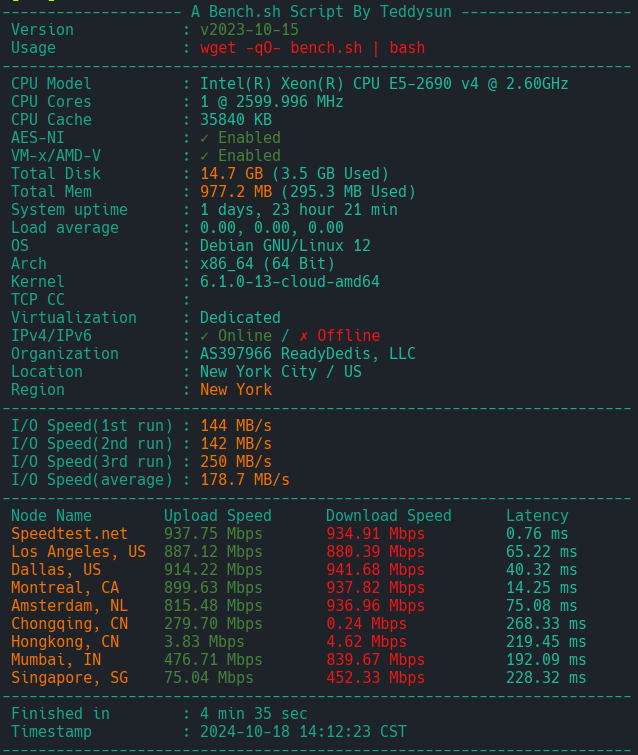

# Utils
## 1. Test Tools
### 1.1 linux server test script
```bash
wget -qO- bench.sh | bash
```
display as below:

### 1.2 linux disk test tool
- [kdiskmark](https://github.com/JonMagon/KDiskMark)
display as below:
